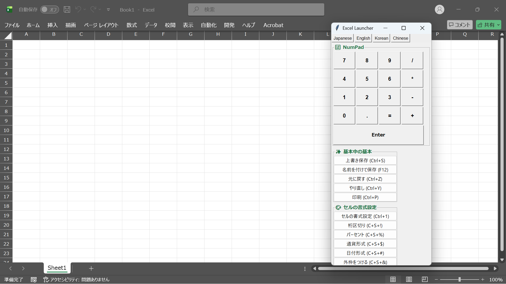
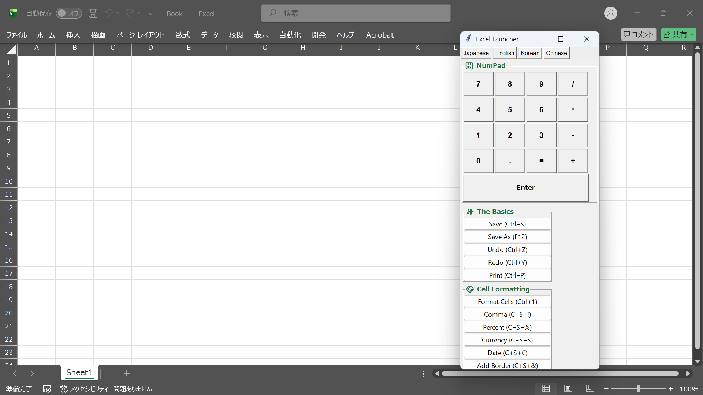
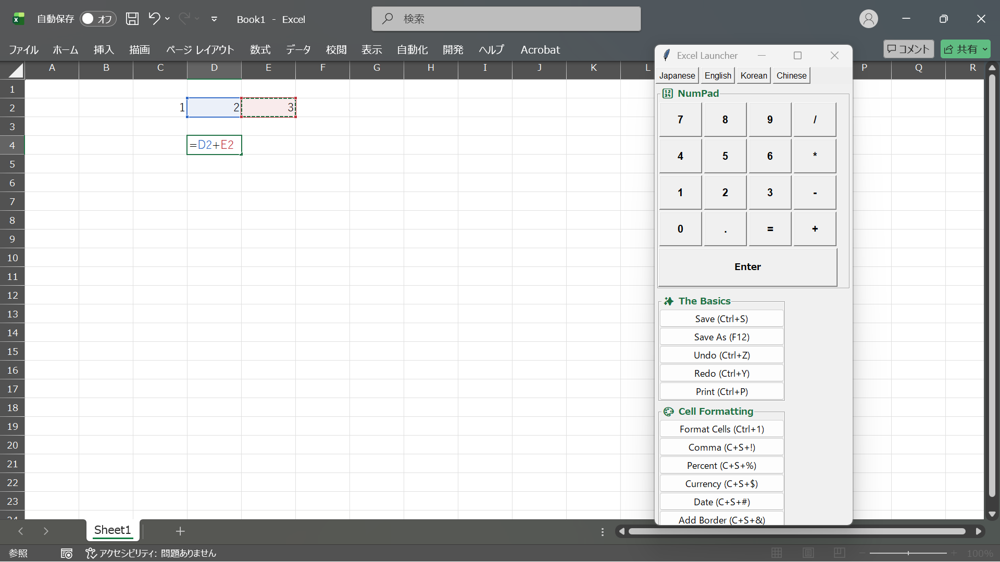

ExcelMultiPad
# ExcelMultiPad

## 📥 [Download EXE (Windows)](https://github.com/HiroTeiichi-japanese/ExcelMultiPad/releases/latest/download/ExcelMultiPad.exe)
↑ クリックするだけで最新版のEXEがダウンロードされます。

### 📸 Screenshots

  
  
  
  

Multi-language Excel Shortcut Launcher with Integrated Numpad

日本語 | English | 한국어 | 简体中文

🇯🇵 日本語 (Japanese)
概要
ExcelMultiPadは、Excel作業を圧倒的に効率化するための軽量デスクトップツールです。
マウス操作だけで、主要なショートカットの実行、4ヶ国語の切り替え、そして便利なテンキー入力が可能です。

特徴
統合テンキー: ノートPCなどテンキーがない環境でも、画面上のボタンで素早く数値入力が可能。

4ヶ国語対応: 日本語、英語、韓国語、中国語のショートカット名を網羅。

スマートフォーカス: ボタンを押すと自動的にExcelへ入力を飛ばし、即座にツールが復帰します。

システムトレイ常駐: 右クリックメニューからいつでも表示・終了が可能です。

🇺🇸 English
Overview
ExcelMultiPad is a lightweight desktop utility designed to supercharge your Microsoft Excel workflow.
Access essential shortcuts, switch between 4 languages, and use an integrated on-screen numpad with just a mouse click.

Features
Integrated Numpad: Perfect for laptops without physical numpads; input numbers and operators easily.

Multilingual Support: Fully localized shortcut names for Japanese, English, Korean, and Chinese.

Smart Focus Control: Automatically switches focus to Excel for input and returns to the tool instantly.

System Tray Integration: Run in the background and access via right-click menu anytime.

🇰🇷 한국어 (Korean)
개요
ExcelMultiPad는 Excel 작업을 획기적으로 효율화하기 위한 가벼운 데스크톱 도구입니다.
마우스 클릭만으로 주요 단축키 실행, 4개 국어 전환, 편리한 숫자 키패드 입력을 지원합니다.

주요 기능
통합 숫자 키패드: 숫자 키패드가 없는 노트북 환경에서도 화면 버튼으로 빠른 숫자 입력 가능.

4개 국어 지원: 일본어, 영어, 한국어, 중국어 단축키 이름 완벽 지원.

스마트 포커스: 버튼 클릭 시 자동으로 엑셀로 입력을 전달하고 즉시 도구 창으로 복귀.

시스템 트레이常駐: 우클릭 메뉴를 통해 언제든지 표시 및 종료 가능.

🇨🇳 简体中文 (Chinese)
概览
ExcelMultiPad 是一款轻量级桌面工具，旨在大幅提升您的 Excel 工作效率。
只需通过鼠标点击，即可执行常用快捷键、切换四种语言并使用便捷的数字小键盘。

功能特点
集成数字键盘: 完美解决笔记本电脑缺少物理小键盘的问题，通过屏幕按钮快速输入。

支持四国语言: 完整收录了日语、英语、韩语和中文的快捷键名称。

智能焦点控制: 点击按钮后自动将输入发送至 Excel，并立即返回工具界面。

系统托盘驻留: 可通过右键菜单随时显示或退出程序。

🛠 Installation / How to use
EXE Version: Download ExcelMultiPad.exe from the Releases page and run it.

Python Version:

Install dependencies: pip install pyautogui pystray pygetwindow Pillow

Run: python ExcelMultiPad.py

License
This project is licensed under the MIT License.
